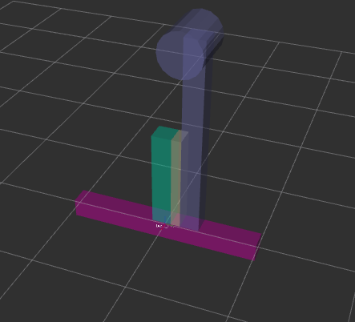
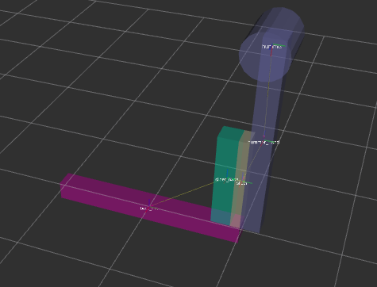
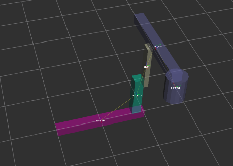
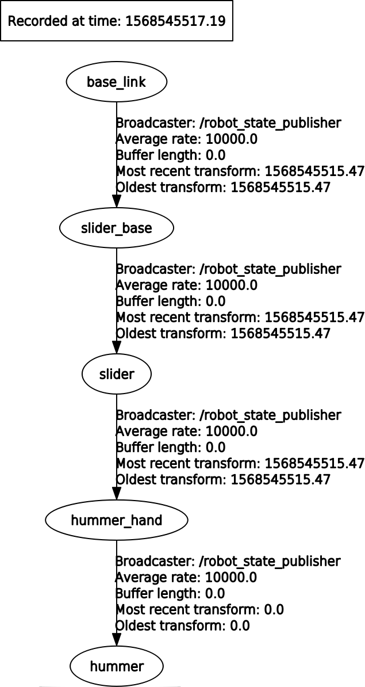

#  Assignment 1

### Robot description:
 - Contains 5 links and 4 joints
 - Two prismatic joints
 - One continuous joint
 - One fixed joint

 Robot view in initial position 

 First prismatic joint move 

 Second prismatic joint move 

 Continuous joint move 

 URDF tree 

### Github link:
https://github.com/jenamax/Introdution-to-Robotics/tree/master/Assignment1

### Run the visualization and control
- build package A1
- run roslaunch A1 display.launch
- it will start visualization in rviz
- the robot can be controlled through console where launch file was started
- input the desired joints positions and the robot will move
