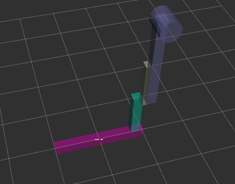

 # Assignment 1

 ### Robot description:
 - Contains 5 links and 4 joints
 - Two prismatic joints
 - One continuous joint
 - One fixed joint

  

 Robot view in initial position 

  

 First prismatic joint move 

  

 Second prismatic joint move 

  

 Continuous joint move 

  

 URDF tree 

