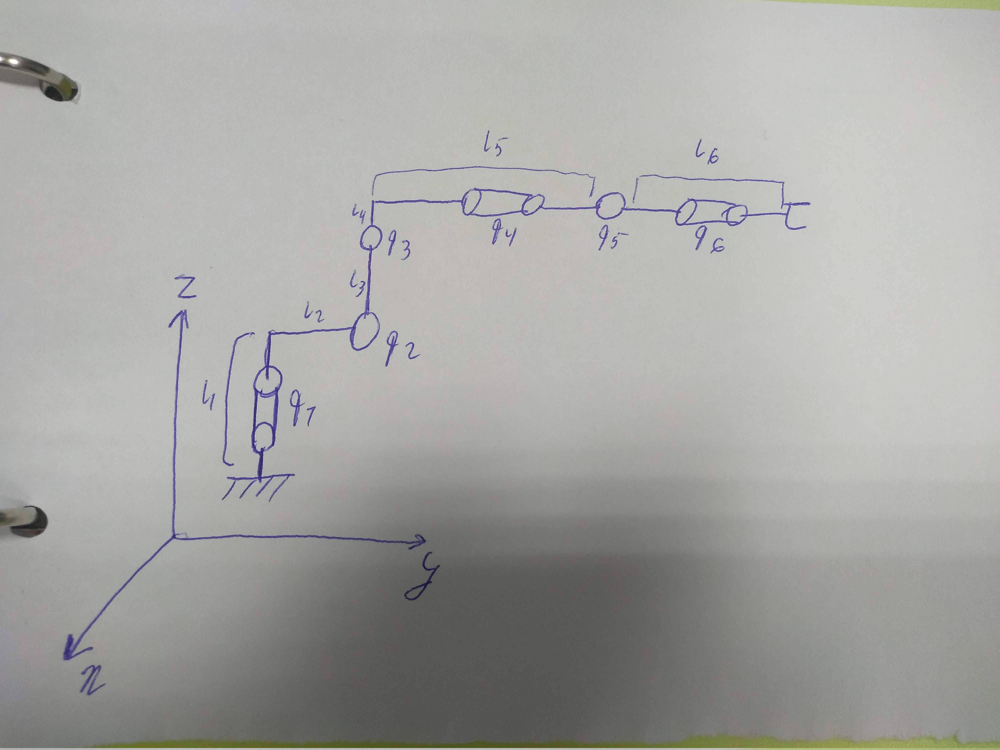

# Assignment 1

## Robot description
- 6 degree of freedom manipulator with spherical wrist FANUC R-2000iC/165
- Construction weight - 1090kg
- Maximal weight of the load - 165kg
- Maximal reachable distance - 2655mm

 Geometrical data about the robot 

 Kinematic scheme of the robot 

- Transformation matrix for the direct kinematic of the robot is H = T(z, l1)R(z, q1)T(y, l2)R(x, q2)T(z, l3)R(x, q3)T(z, l4)T(y, l5)R(y, q4)R(x, q5)R(y, q6)T(y, l6) where T - translation matrix along one of axis on the defined length, R - rotation matrix around one of axis on defined angle
- Length for translation transform taken from drawing (in mm): l1 = 670, l2 = 312, l3 = 1075, l4 = 225, l5 = 1280, l6 = 215

 Robot visualization in rviz 

## Github link
- https://github.com/jenamax/Introdution-to-Robotics/tree/master/Assignment2

### Run the visualization and control
- build package fanuc
- run roslaunch fanuc control.launch
- it will start visualization in rviz
- the robot can be controlled through console where launch file was started
- input the robot base coordinates and desired joints positions and the robot will move and display the calculated position (from direct kinematic) of end effector
