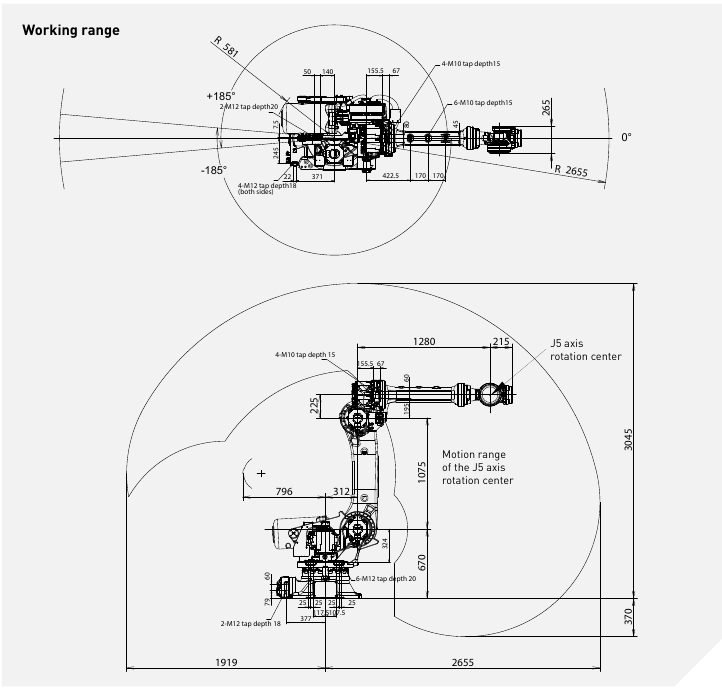

# Assignment3
## Jacobians computation for  FANUC R-2000iC/165F

### Robot description
- 6 degree of freedom manipulator with spherical wrist FANUC R-2000iC/165
- Construction weight - 1090kg
- Maximal weight of the load - 165kg
- Maximal reachable distance - 2655mm

 Geometrical data about the robot 

 Kinematic scheme of the robot 

### Numerical method for Jacobians computations
- Compute direct kinematic for the robot:
  - Transformation matrix for the direct kinematic of the robot is H = T(z, l1)R(z, q1)T(y, l2)R(x, q2)T(z, l3)R(x, q3)T(z, l4)T(y, l5)R(y, q4)R(x, q5)R(y, q6)T(y, l6) where T - translation matrix along one of axis on the defined length, R - rotation matrix around one of axis on defined angle
  - Length for translation transform taken from drawing (in mm): l1 = 670, l2 = 312, l3 = 1075, l4 = 225, l5 = 1280, l6 = 215
- Compute derivative of transformation matrices for each joint by feedforward direct kinematics computation replacing the rotation matrix for current joint on derivative of elementary rotation matrix for the axis which corresponds to this joint
- Compute Jacobian matrix rows as follows:
  - J[0, i] = T[i][0, 3]
  - J[1, i] = T[i][1, 3]
  - J[2, i] = T[i][2, 3]
  - J[3, i] = (T[i] * D_inv)[2, 1]
  - J[4, i] = (T[i] * D_inv)[0, 2]
  - J[5, i]= (T[i] * D_inv)[1, 0]
  - where i - row number, T[i] - derivative matrix from previous step, D_inv - inverted direct kinematics matrix
- Concatenate received rows

### Jacobians computations with skew theory
- Compute transformation matrices from base to each joint
- From each of these matrices take vector Zi with coordinates of rotation axis for each joint (for rotation around z axis it will be first 3 elements of 3rd column, for y - first 3 elements of 2nd column, for x - first 3 elements of 1st column)
- Also take the translation vector Oi from each of these transformation matrices
- Compute Jacobian matrix columns as follows: Ji = [Zi - 1x(O6 - Oi - 1); Zi - 1]
- Concatenate columns

### Github link
- https://github.com/jenamax/Introdution-to-Robotics/tree/master/Assignment3
