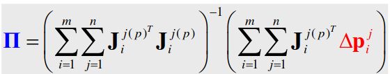

# Assignment3
## Jacobians computation for  FANUC R-2000iC/165F

### Robot description
- 6 degree of freedom manipulator with spherical wrist FANUC R-2000iC/165
- Construction weight - 1090kg
- Maximal weight of the load - 165kg
- Maximal reachable distance - 2655mm

 Geometrical data about the robot 

 Kinematic scheme of the robot 

### Modeling
- Complete model for the robot:

  T = Tbase Tz0 Rz(q1 + dq1)[Tx1 Ty1 Rx1 Ry1]L1 Rx(q2 + dq2)[Tz2 Ty2 Rz2 Ry2]L2 Rx(q3 + dq3)[T z3 Ty3 Rz3 Ry3]L3 Ry(q4 + dq4)[T z4 Tx4 Rz4 Rx4]L4 Rx(q5 + dq5)[T z5 Ty5 Rz5 Ry5]L5 Ry(q6 + dq6)[T z6 Tx6 Rz6 Rx6]L6 Ttool
- where q1, q2, q3, q4, q5, q6 - joint angles, dq1, dq2, dq3, dq4, dq5, dq6 - errors in joint angles, Tz0 - translation of first link (on l1, with error), Ty1 - translation of 2nd link (on l2, with error), Tz2 - translation of 3rd link (on l3, with error), Tz3, Ty3 - translations of 4th link (on l4 by z and l5 by y, with error), other matrices stand for errors in links and joints mounts positions

- Move Tz0 to base, 6th link to tool, apply reduction rules and get the following irreducible model:

  T = Tbase Rz(q1 + dq1)[Tx1 Ty1 Ry1]L1 Rx(q2 + dq2)[Tz2 Rz2 Ry2]L2 Rx(q3 + dq3)[T z3 Ty3 Rz3]L3 Ry(q4 + dq4)[T z4 Tx4 Rz4]L4 Rx(q5 + dq5)[T z5 Rz5]L5 Ry(q6 + dq6)Ttool

- Calibration procedure:
  1. Initially set all errors to 0
  2. Generate 30 random configurations
  3. Compute the expected (calculated from estimated model) tools positions and transformation matrix for robot (for 3 tools) and real (from the model which include real error values)
  4. From estimated transformation matrix get position and orientation of end effector relative to base, make skew-symmetric matrix for position vector
  5. Estimate base and tools positions by formula (where [~p] - skew symmetric matrix from 4, Δpi - difference between true and estimated position value for all tools from ith measured configuration, A has dimensions 9x15 since there are 3 tools):
  
  6. Compute (using numerical method) Jacobians of matrix TbaseTrobotTtool by error parameters
  7. Compute new parameters for robot transformation matrix by formula (m = 30 - num of experiments, j = 3 - num of tools):
  
  8. Repeat 2 - 7 during some number of iterations

### Github link
- https://github.com/jenamax/Introdution-to-Robotics/tree/master/Assignment4
