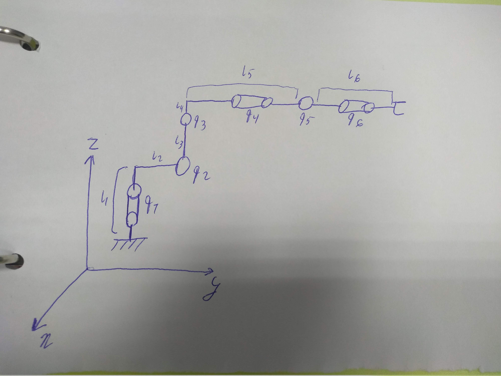
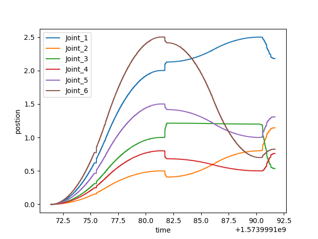
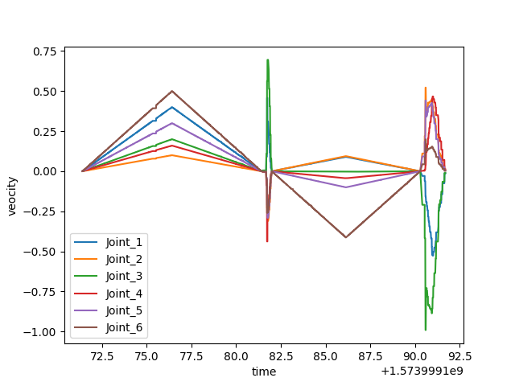
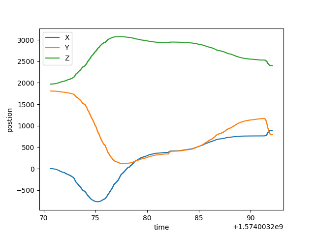
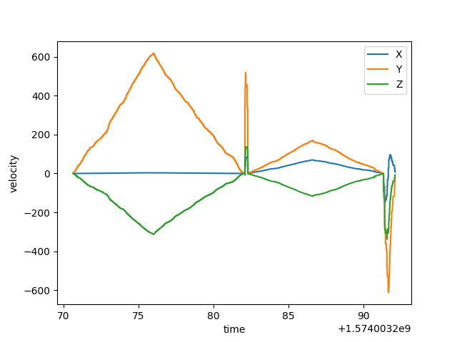

# Assignment5
## Trajectory planning for  FANUC R-2000iC/165F

### Robot description
- 6 degree of freedom manipulator with spherical wrist FANUC R-2000iC/165
- Construction weight - 1090kg
- Maximal weight of the load - 165kg
- Maximal reachable distance - 2655mm

 Geometrical data about the robot 

 Kinematic scheme of the robot 

### Trajectory planning for PTP command
1. Take desired position for each joint as input
2. Compute velocity profile parameters for each joint
  - Define shape of this profile: if (a_max * dq)1 / 2 > V_max => trapezoid, otherwise triangle, where V_max and a_max - maximal velocity and acceleration of the joint, dq - desired change in joint position
  - Compute time point when finish speed up
  - Compute time when finish move on maximal velocity (in case of triangular profile it will be equal to speed up finish time)
  - Compute the time when finish movement
3. Correct velocity profiles such that all joints stop simultaneously
4. In time interval from movement start set joints velocity in accordance with computed velocity profile

### Trajectory planning for LIN command
1. Take desired position of end-effector as input
2. Compute velocity profiles for x, y and z displacement in the same way as in PTP command
3. In time interval from movement start set joints velocity by extracting velocity in Cartesian space and multiplying on inverse Jacobians (setting all angular velocities = 0 since movement is linear)

Note that sometimes LIN command can bring end-effector not exactly to desired position. It happens because sometimes computer cannot provide 100Hz frequency. In PTP command it can because it is not require Jacobians computation which is quite costly (and operation system on the computer is not real-time). You can check control frequency during command execution on the program output in terminal.

 Plots for position and velocity of joints during execution sequentially PTP, LIN, PTP, LIN commands

 Plots for position and velocity of end effector in Cartesian space

### Github link
- https://github.com/jenamax/Introdution-to-Robotics/tree/master/Assignment5
